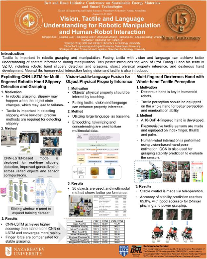
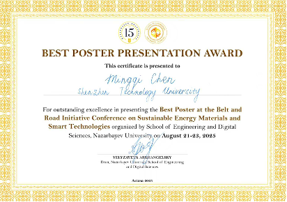

Dr. Chen Mingqi, postdoc of AGDR is invited to visit Astana from August 20 to 23 to attend the Belt and Road Initiative (BRI) Conference on Sustainable Energy Materials and Smart Technologies hosted by Nazarbayev University (NU) and to meet with colleagues at the NU’s Tactile Robotics Laboratory.
<!--more-->

The conference, organized by the School of Engineering and Digital Sciences at NU, took place from August 21 to 23. The opening ceremony on August 21 featured remarks from Liping Niu, First Secretary of the Embassy of the People’s Republic of China in Kazakhstan; Dr. Waqar Ahmad, President of NU; and Dr. Elizabeth Arkhangelsky, Dean of the School of Engineering and Digital Sciences. Domestic and international keynote speakers including Associate Prof. Fei Liang (Northwestern Polytechnical University), Prof. Xuhui Sun and Prof. Zhen Wen (Soochow University), and Dr. Volodymyr Tarabara (Michigan State University), among others.
On the afternoon of August 21, Dr. Chen of AGDR presented a poster entitled “Vision, Tactile and Language Understanding for Robotic Manipulation and Human‑Robot Interaction.” The poster was co-authored by Zexiang Guo, Hengxiang Chen, Haoliang Xu, Zhenyuan Zhang, Han Xu, and Shukun Huang from AGDR. The presentation sparked in‑depth discussion with peer reviewers and attending scholars and was awarded the conference’s Best Poster Presentation. Dr. Chen also participated in a leadership meeting with the School of Engineering and Digital Sciences on August 22 and represented Shenzhen Technology University (SZTU) on “Education and Research Opportunities in China” forum, where he introduced SZTU, College of Big Data and Internet, and AGDR.

At the invitation of Dr. Zhanat Kappassov, Principal Investigator (PI) of the Tactile Robotics Lab, Dr. Chen visited NU’s Robotics Department and held in‑depth technical exchanges with lab members on tactile perception and intelligent robotic manipulation.

This visit is part of the collaboration activities under the Ministry of Science and Technology’s “China–Kazakhstan Partner Exchange Program”. AGDR at SZTU and the Tactile Robotics Lab at NU have secured funding under the program, with Prof. Qiang Li and Dr. Zhanat Kappassov serving as PIs for the Chinese and Kazakh teams, respectively. The partnership will focus on joint research in tactile preception, robotic intelligence, and related fields.